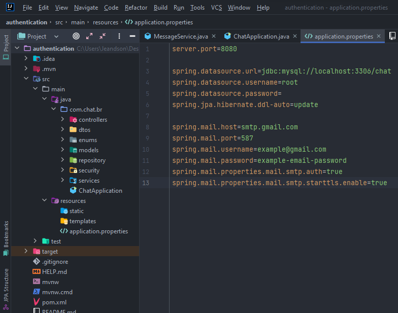

    
    

# Spring Boot Chat API
Chat for sending messages with registered people.

## Getting Started

### Execution

To run the project, it is necessary to have Java 17, and a database running, preferably MySQL. It is also necessary to pass the settings of the application.properties file, these settings are information for connecting to the database, and for sending emails.

### Documentation with swagger

http://localhost:8080/swagger-ui/index.html

### Reference Documentation
For further reference, please consider the following sections:

* [Official Apache Maven documentation](https://maven.apache.org/guides/index.html)
* [Spring Boot Maven Plugin Reference Guide](https://docs.spring.io/spring-boot/docs/3.0.0-SNAPSHOT/maven-plugin/reference/html/)
* [Create an OCI image](https://docs.spring.io/spring-boot/docs/3.0.0-SNAPSHOT/maven-plugin/reference/html/#build-image)
* [Spring Web](https://docs.spring.io/spring-boot/docs/3.0.0-SNAPSHOT/reference/htmlsingle/#web)
* [Java Mail Sender](https://docs.spring.io/spring-boot/docs/3.0.0-SNAPSHOT/reference/htmlsingle/#io.email)
* [Validation](https://docs.spring.io/spring-boot/docs/3.0.0-SNAPSHOT/reference/htmlsingle/#io.validation)
* [Spring Data JPA](https://docs.spring.io/spring-boot/docs/3.0.0-SNAPSHOT/reference/htmlsingle/#data.sql.jpa-and-spring-data)

### Guides
The following guides illustrate how to use some features concretely:

* [Building a RESTful Web Service](https://spring.io/guides/gs/rest-service/)
* [Serving Web Content with Spring MVC](https://spring.io/guides/gs/serving-web-content/)
* [Building REST services with Spring](https://spring.io/guides/tutorials/rest/)
* [Accessing data with MySQL](https://spring.io/guides/gs/accessing-data-mysql/)
* [Validation](https://spring.io/guides/gs/validating-form-input/)
* [Accessing Data with JPA](https://spring.io/guides/gs/accessing-data-jpa/)

